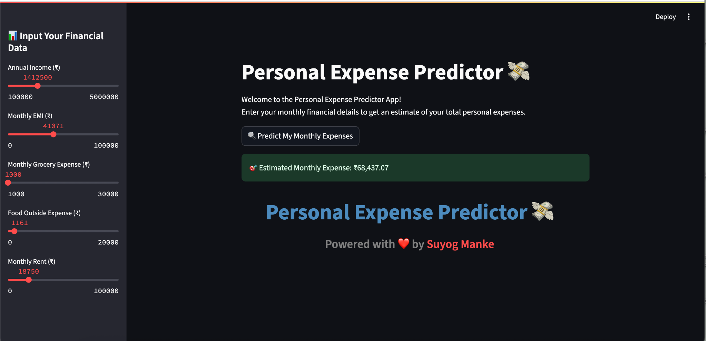

# End-to-End - 💸 FinSight – Intelligent Personal Expense Predictor

FinSight is a machine learning-powered web app that predicts an individual's **monthly personal expenses** based on their income and spending patterns.  
Built using **Python, Ridge Regression, and Streamlit**, this tool offers an **instant, data-driven financial insight** for budgeting and planning.

---

## 🚀 Demo


[Streamlit Demo Link] : https://finsight-end-to-end-personal-expense-prediction-system.streamlit.app/

---

## ✨ Features

- 📊 **Interactive UI** – Clean and responsive Streamlit interface  
- ⚡ **Real-Time Predictions** – Instantly get your estimated monthly expenses  
- 🔍 **Minimal Input, Maximum Insight** – Only 5 key financial parameters needed  
- 📱 **Responsive Design** – Works seamlessly on desktop and mobile  
- ❤️ **Personal Touch** – Custom branding and engaging UI

---


## 🧠 How It Works

1. **Data Input** – User enters financial details such as:
   - Annual Income
   - EMI
   - Grocery Expenses
   - Food Outside Expenses
   - Rent
2. **Prediction Engine** – Data is fed into a **trained Ridge Regression model**  
3. **Output** – Predicted monthly expenses are displayed instantly


🛠️ Tech Stack
Python 3.9+

Pandas & NumPy – Data handling

Scikit-learn – Ridge Regression model

Streamlit – Web application framework

Joblib – Model serialization

📈 Potential Use Cases
Personal Budgeting – Plan and optimize monthly spending

Financial Advisory Tools – Integrate into fintech platforms

Banking Applications – Pre-loan expense estimation

🎯 Future Improvements
📊 Expense trend visualization

🧮 Support for more advanced ML models

🌍 Multi-currency support

🔐 User authentication and history tracking

## ⚙️ Installation

```bash
# Clone this repository
git clone https://github.com/SuyogDeepMind/FinSight.git
cd FinSight

# Install dependencies
pip install -r requirements.txt

# Run the Streamlit app
streamlit run app.py


👨‍💻 Author
Suyog Manke
Powered with ❤️ by Suyog Manke
LinkedIn : https://www.linkedin.com/in/suyogmanke/
Gitub : https://github.com/SuyogDeepMind

